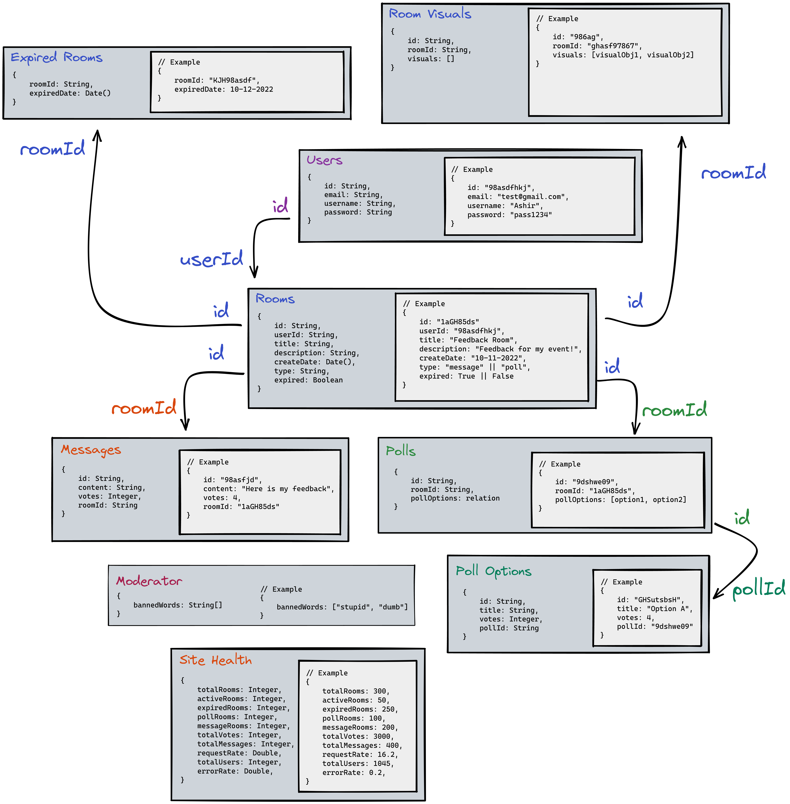
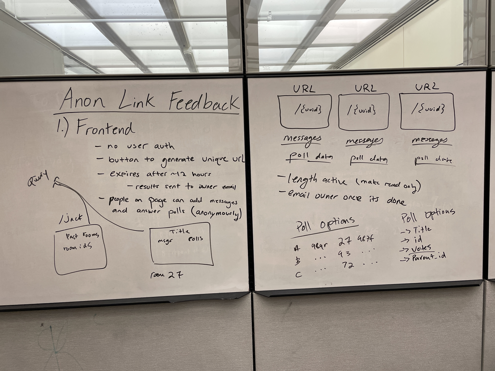
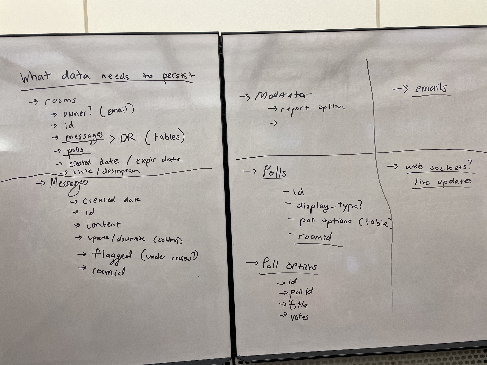

# Team Blazingly Fast

## letsthink - Milestone 1

Version 0.1

---

## Application Domain

The application is an anonymous feedback collection website where a user can create a room accessible through a unique url that contains either a message board, poll, or both. The user can then share the generated url to as many people as they’d like and have the room expire after a set amount of hours.​ After the room expires, the contents that were recorded throughout its duration are compiled and sent to the owner’s email. The room should be able to support a large number of users at once and update live when new poll responses or messages are sent. Once the room expires, it will no longer accept messages/votes and enter a read only state. This application could be part of a larger idea and extended beyond our implementation.

---

## Data Model

The application has the following date types:

**Users:** The users object stores the information for each signed up user.

##### - Owner: Jack Bisceglia, Email: jbisceglia@umass.edu , Github: jackbisceglia

**Rooms:** A room object contains all the relevant information pertaining to a room, such as its title and type (poll or messages).

##### - Owner: Joe Petrillo, Email: jpetrillo@umass.edu, Github: joepetrillo

##### - Owner: Ashir Imran, Email: aimran@umass.edu, Github: aimran

**Messages:** Stores every message that is sent to a room.

##### - Owner: Ashir Imran, Email: aimran@umass.edu, Github: aimran

**Polls/Poll Options:** Stores polls and their related options for a room.

##### - Owner: Ashir Imran, Email: aimran@umass.edu, Github: aimran

**Expired Rooms:** Keeps track of which rooms are expired.

##### - Owner: Joe Petrillo, Email: jpetrillo@umass.edu, Github: joepetrillo

**Room Visuals:** Contains the visualized versions of expired rooms.

##### - Owner: Joe Petrillo, Email: jpetrillo@umass.edu, Github: joepetrillo

##### - Owner: Siddharth Raju, Email: sraju@umass.edu , Github: sid2033

**Moderator:** Has a list of banned words that are referenced after stemming and tokenizing each comment.

##### - Owner: Jack Bisceglia, Email: jbisceglia@umass.edu , Github: jackbisceglia

##### - Owner: Siddharth Raju, Email: sraju@umass.edu , Github: sid2033

**Site Health:** Various website statistics used for monitoring.

##### - Owner: Siddharth Raju, Email: sraju@umass.edu , Github: sid2033

##### - Owner: Jack Bisceglia, Email: jbisceglia@umass.edu , Github: jackbisceglia

_Below is a diagram for each data model in JSON with examples and how they related to each other._



---

## Services

**Rooms Service:** The client will communicate with this service to create a new room. The database will keep track of all rooms (expired or not), and only allow new room creation from authenticated users.

##### - Owner: Joe Petrillo, Email: jpetrillo@umass.edu, Github: joepetrillo

**Messages Service:** The client will communicate with this service to create a new message. The database will keep track of all messages that have been moderated (after creation), and the amount of votes associated with each.

##### - Owner: Ashir Imran, Email: aimran@umass.edu, Github: aimran

**Polls Service:** This service is responsible for creating a new poll. The database will store the options and vote counts for each option.

##### - Owner: Ashir Imran, Email: aimran@umass.edu, Github: aimran

**Moderator service:** The moderator service stores a list of banned words. Everytime it receives a message creation event, it will first check that message against the list before approving it and sending it back to the messages service and client.

##### - Owner: Jack Bisceglia, Email: jbisceglia@umass.edu , Github: jackbisceglia

**Email service:** This service is responsible for notifying a room owner about all the relevant room data when one of their rooms expires. This data is retrieved from the visualizer service which is then processed and sent to the owner’s email.

##### - Owner: Jack Bisceglia, Email: jbisceglia@umass.edu , Github: jackbisceglia

**Users service:** This service is responsible for creating a new user or retrieving existing user details. The database stores all the info related to users. The authentication service will have to communicate here.

##### - Owner: Jack Bisceglia, Email: jbisceglia@umass.edu , Github: jackbisceglia

**Authenticator Service:** The authenticator handles authentication and logging in users as well as making sure that a user session is valid when attempting to access secure pages.

##### - Owner: Ashir Imran, Email: aimran@umass.edu, Github: aimran

**Expiration Service:** This service keeps track of when a room is created and when it expires. When a room expires, it notifies the visualizer service, rooms service, query service, and the site health service.

##### - Owner: Joe Petrillo, Email: jpetrillo@umass.edu, Github: joepetrillo

**Site Health Service:** This service receives a majority of the events being emitted by other services in order to keep track of various site related statistics. These can then be viewed on the client side on a “site health page”. This would monitor things like number of users, number of open rooms, HTTP error rate, etc.

##### - Owner: Siddharth Raju, Email: sraju@umass.edu , Github: sid2033

**Visualizer Service:** This service is responsible for processing when a room expires. It will take all the data relevant to the expired room and format it appropriately in a clean, visualized image format. This data is utilized by the email and user service.

##### - Owner: Siddharth Raju, Email: sraju@umass.edu , Github: sid2033

**Query Service:** The query service is used to get data back to the client to reduce the number of network calls to each service. Storing the data in one service can result in much fewer requests and increase speed as shown in our lecture example. This service will store the data which results in data duplication, but is an expected result of using microservices.

##### - Owner: Siddharth Raju, Email: sraju@umass.edu , Github: sid2033

**Vote Service:** This service handles voting for messages and polls. On the client side, a user can upvote or downvote a message in a room. This will be sent to the vote service, which will handle updating a messages vote count property. This is then sent to the messages service to update that data, and to the query service to update the client side UI. The same thing is done when a user votes on a poll option. This service also communicates with site health to keep track of the number of votes.

##### - Owner: Joe Petrillo, Email: jpetrillo@umass.edu, Github: joepetrillo

_Below is a diagram showing all of the services and how they interact with the event bus and client. We've also included a mockup of what the frontend webpages might look like._


---

## Endpoints

### Create Room (Rooms Service)

**Route:** /rooms

**Method:** POST

**JSON Body (Example):**

```json
{
  "userId": "89ashJHSb",
  "title": "Feedback Room",
  "description": "This is to get feedback for my event",
  "type": "< poll / message >"
}
```

The type can be poll or message.

**JSON Response (Example):**

Status Code: **201**

```json
{
  "roomId": "sKHJ8bs"
}
```

### Create Message (Messages Service)

**Route:** /messages

**Method:** POST

**JSON Body (Example):**

```json
{
  "userId": "gGJ09un",
  "roomId": "098dnlksg",
  "content": "This is a feedback comment"
}
```

**JSON Response (Example):**

Status Code: **200**

```json
{
  "id": "sKHJ8bsd",
  "content": "This is a feedback comment",
  "votes": 0,
  "roomId": "098dnlksg"
}
```

**JSON Response (Example):**

Status Code: **422**

```json
{
  "alert": "Comment contains a banned word!"
}
```

### Create User (Authenticator Service)

**Route:** /users/signup

**Method:** POST

**JSON Body (Example):**

```json
{
  "username": "aimran",
  "password": "pass1234",
  "email": "test@gmail.com"
}
```

**JSON Response (Example):**

Status Code: **201**

```json
{
  "userId": "8ohdfw0s97",
  "username": "aimran"
}
```

### Login User (Authenticator Service)

**Route:** /users/login

**Method:** POST

**JSON Body (Example):**

```json
{
  "username": "aimran",
  "password": "pass1234"
}
```

**JSON Response (Example):**

Status Code: **200**

```json
{
  "session": "89hjkKHJFdd"
}
```

### Logout User (Authenticator Service)

**Route:** /users/logout

**Method:** POST

**JSON Response (Example):**

Status Code: **200**

```json
{
  "status": "< success / error >"
}
```

### Vote Message (Votes Service)

**Route:** /messages/:messageId

**Method:** PUT

**JSON Body (Example):**

```json
{
  "messageId": "aimran",
  "roomId": "pass1234",
  "vote": 1
}
```

**JSON Response (Example):**

Status Code: **200**

```json
{
  "votes": 3
}
```

### Vote Poll (Votes Service)

**Route:** /polls/:pollId

**Method:** PUT

**JSON Body (Example):**

```json
{
  "pollId": "aimran",
  "roomId": "pass1234",
  "option": "Option A"
}
```

**JSON Response (Example):**

Status Code: **200**

```json
{
  "Option A": 74
}
```

### Get Room (Query Service)

**Route:** /rooms/:roomId

**Method:** GET

**JSON Response (Example):**

Status Code: **200**

```json
{
  "id": "1aGH85ds",
  "userId": "98asdfhkj",
  "title": "Feedback Room",
  "description": "Feedback for my event!",
  "createDate": "10-11-2022",
  "expire": true,
  "type": "< message / poll >"
  "data": ["< messages / polls >"]
}
```

### Get Past Rooms (Query Service)

**Route:** /users/:userId/rooms

**Method:** GET

**JSON Response (Example):**

Status Code: **200**

```json
{
  "pastRooms": ["roomObj1", "roomObj2", "roomObj3"]
}
```

### Get Visual (Query Service)

**Route:** /rooms/:roomId/visual

**Method:** GET

**JSON Response (Example):**

Status Code: **200**
Generated from a library

```json
{
  "visual": {"visualData"}
}
```

---

## Events and Communication

| Service            | Event                                                                                                                                                                                                                                                              | Emit/Receive | Description                                                                                                                                                                                                                                                                                                 |
| ------------------ | ------------------------------------------------------------------------------------------------------------------------------------------------------------------------------------------------------------------------------------------------------------------ | ------------ | ----------------------------------------------------------------------------------------------------------------------------------------------------------------------------------------------------------------------------------------------------------------------------------------------------------- |
| Rooms              | `"type" : "RoomCreated"`                                                                                                                                                                                                                                           | Emit         | When a user creates a room, they POST to the Rooms service, which emits this event. This lets other relevant services know that a Room has been created, and sends along the necessary room data in JSON.                                                                                                   |
| Rooms              | `"type" : "RoomExpired"`                                                                                                                                                                                                                                           | Receive      | When a room expires, the Rooms service receives an event, which lets it update the Rooms database and change the "expired" flag on a particular room.                                                                                                                                                       |
| Messages           | `"type" : "MessageCreated"`                                                                                                                                                                                                                                        | Emit         | When a user creates a message, the Messages service receives it and emits an event, which allows other services to use the message data.                                                                                                                                                                    |
| Messages           | `"type" : "MessageVoted"`                                                                                                                                                                                                                                          | Receive      | When the Votes service processes a user's upvote or downvote, the Messages service receives that event and updates the database. This update will only happen if the room for the message is not expired.                                                                                                   |
| Messages           | `"type" : "MessageModerated"`                                                                                                                                                                                                                                      | Receive      | After the Moderator service processes a message, it is sent back to the Messages service and can be stored. No message is stored until it is moderated.                                                                                                                                                     |
| Messages           | `"type" : "RoomCreated"`                                                                                                                                                                                                                                           | Receive      | The messages service keeps track of which rooms are currently open, so that it can disallow messaging on expired or invalid rooms.                                                                                                                                                                          |
| Messages           | `"type" : "RoomExpired"`                                                                                                                                                                                                                                           | Receive      | The messages service keeps track of which rooms are expired, so that it can disallow messaging on expired or invalid rooms.                                                                                                                                                                                 |
| Polls              | `"type" : "PollCreated"`                                                                                                                                                                                                                                           | Emit         | When a user creates a Room with the "poll" type, the Polls service will create and store the poll with all its options, and emit an event for other services to use. This event carries poll data in JSON.                                                                                                  |
| Polls              | `"type" : "PollVoted"`                                                                                                                                                                                                                                             | Receive      | Once the Votes service processes a poll vote, the Polls service will update its database to reflect votes.                                                                                                                                                                                                  |
| Polls              | `"type" : "RoomCreated"`                                                                                                                                                                                                                                           | Receive      | The polls service keeps track of which rooms are currently open, so that it can disallow voting or creating polls on expired or invalid rooms.                                                                                                                                                              |
| Polls              | `"type" : "RoomExpired"`                                                                                                                                                                                                                                           | Receive      | The polls service keeps track of which rooms are expired, so that it can disallow voting or creating polls on expired or invalid rooms.                                                                                                                                                                     |
| Users              | `"type" : "UserCreated"`                                                                                                                                                                                                                                           | Emit         | When a user signs up for an account, the Users service will create a User object and emit an event with the new user data to other services.                                                                                                                                                                |
| Authenticator      | `"type" : "UserCreated"`                                                                                                                                                                                                                                           | Receive      | When a user signs up, the authenticator will receive an event with it's information, so that it can create a session for that user and automatically log them in.                                                                                                                                           |
| Expiration Checker | `"type" : "RoomExpired"`                                                                                                                                                                                                                                           | Emit         | After a room has been active for it's chosen amount of time, the service will emit an event letter other services know that it has expired.                                                                                                                                                                 |
| Expiration Checker | `"type" : "RoomCreated"`                                                                                                                                                                                                                                           | Receive      | When a room is created, the Expiration Checker service can start a timer/scheduled event for when the room has to expire.                                                                                                                                                                                   |
| Email              | `"type" : "RoomVisualized"`                                                                                                                                                                                                                                        | Receive      | Once a visualization for a room has been created, the email service will be notified and send out that information to the user's email address.                                                                                                                                                             |
| Visualizer         | `"type" : "RoomVisualized"`                                                                                                                                                                                                                                        | Emit         | Creates a visualiation of a room and sends it out to other services for use.                                                                                                                                                                                                                                |
| Visualizer         | `"type" : "RoomExpired"`                                                                                                                                                                                                                                           | Receive      | The service is alerted of a room's expiration, so that it can start creating a visualization.                                                                                                                                                                                                               |
| Votes              | `"type" : "PollVoted"`                                                                                                                                                                                                                                             | Emit         | When a user votes on a poll, the Votes service will process that vote and send an event to other services with that vote data.                                                                                                                                                                              |
| Votes              | `"type" : "MessageVoted"`                                                                                                                                                                                                                                          | Emit         | When a user upvotes or downvotes a message, the Votes service will process that vote and send an event to other services with that vote data.                                                                                                                                                               |
| Votes              | `"type" : "RoomCreated"`                                                                                                                                                                                                                                           | Receive      | The Votes service will keep track of which rooms are open, in order to prevent voting on expired rooms.                                                                                                                                                                                                     |
| Votes              | `"type" : "RoomExpired"`                                                                                                                                                                                                                                           | Receive      | The Votes service will keep track of which rooms are expired, in order to prevent voting on expired rooms.                                                                                                                                                                                                  |
| Moderator          | `"type" : "MessageModerated"`                                                                                                                                                                                                                                      | Emit         | Once a message has been processed and compared to the stored banned words list, an event is sent out to other services with the comment and it's status so that it can be used.                                                                                                                             |
| Moderator          | `"type" : "MessageCreated"`                                                                                                                                                                                                                                        | Receive      | When the Messages service receives a new comment, the Moderator Service is sent that comment for processing.                                                                                                                                                                                                |
| Site Health        | `"type" : "RoomExpired"` <br/><br/> `"type" : "RoomCreated"` <br/><br/> `"type" : "MessageModerated"` <br/><br/> `"type" : "UserCreated"` <br/><br/> `"type" : "PollVoted"` <br/><br/> `"type" : "MessageVoted"` <br/><br/> `"type" : "HTTPRequest"`               | Receive      | The Site Health service receives all events related to data being created or modified. This is then used to keep track of various site statistics and responsiveness of the website. Everytime one of these events is received, a count in the Site Health database would be updated to reflect that event. |
| Query              | `"type" : "RoomCreated"` <br/><br/> `"type" : "PollCreated"` <br/><br/> `"type" : "PollVoted"` <br/><br/> `"type" : "MessageVoted"` <br/><br/> `"type" : "MessageModerated"` <br/><br/> `"type" : "RoomVisualized"` <br/><br/> `"type" : "RoomExpired"` <br/><br/> | Receive      | The query service stores a cache of all the data that is needed for the client. This includes Room information, polls, messages, updated voting counts, expiration status, and visuals.                                                                                                                     |

---

## Meeting Notes

### Meeting 1 Notes: 10/11/22

**Attendees (everyone attended):**

- Joe
- Sid
- Ashir
- Jack

**Topics Discussed:**
We discussed overall project ideas, architecture concepts, and organization/work splitting. We first discussed all of our ideas which we had brainstormed prior at [https://497-idea-sheet.vercel.app/](). We decided on making an anonymous link feedback website, where users can create a room that allows anyone with the link to make posts. We whiteboard our ideas and started working on this doc to get our ideas down. We have taken pictures, attached below. Brainstorm can also be found at [https://497-idea-sheet.vercel.app/anonymous-feedback-links]().




### Meeting 2 Notes: 10/12/22

**Attendees (everyone attended):**

- Joe
- Sid
- Ashir
- Jack

**Topics Discussed:**
We finalized our data models, and started to create the diagram showing our services. We mainly went over all the events each service emits and receives, and updated our data models along the way if necessary. Implementation strategies did come up during this meeting, just so we have a solid plan and diagram to follow before we start coding.

### Meeting 3 Notes: 10/13/22

**Attendees (everyone attended):**

- Joe
- Sid
- Ashir
- Jack

**Topics Discussed:**
We finalized the services diagram, and began writing out descriptions.

### Meeting 4 Notes: 10/13/22

**Attendees (everyone attended):**

- Joe
- Sid
- Ashir
- Jack

**Topics Discussed:**
We transfered our document from Google Docs to a markdown file in our Github Repository. Then we were able to write out our endpoints with JSON request/response examples. We also revamped our services diagram, and then created descriptions for each of our events. We also talked to Tim about some of our services, and how best to tackle them in implementation.
